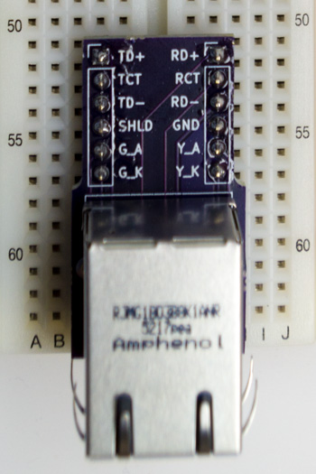

This repository contains KiCad 4.x files for a small breakout board
which allows an Ethernet jack (with built-in magnetics) to be used on
a breadboard.

* [Schematic](RJ45.pdf)

## Bill of Materials

* [Amphenol RJMG1BD3B8K1ANR MagJack](https://www.digikey.com/product-detail/en/amphenol-commercial-products/RJMG1BD3B8K1ANR/RJMG1BD3B8K1ANR-ND/5359794)
* 2 strips of male header, 8 pins each

## Pins

* **TD+, TCT, and TD-**: positive, center tap, and negative pin for the transmit side
* **TD+, RCT, and RD-**: ditto for receive side
* **GND**: ground pin on the MagJack
* **SHLD**: metal housing of the MagJack
* **G_A and G_K**: anode and cathode for the green LED
* **Y_A and Y_K**: ditto for the yellow LED
